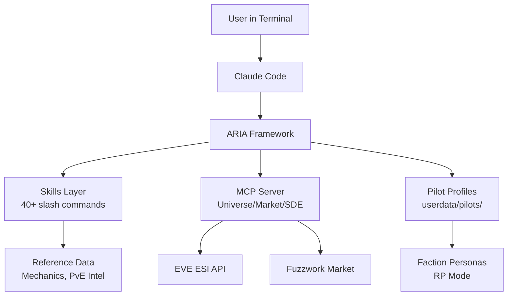

# GitHub Release Readiness Worklist

**Status:** ✅ COMPLETE (2026-02-02)
**Completed:** All items - CHANGELOG, CI workflows, README sample output, CI badge, "What This Is Not" section, FAQ, architecture diagram, docs navigation guide
**Remaining:** None (ready for archive)

> **Validation (2026-02-02):** Items previously marked "remaining" were found to exist:
> - FAQ: `docs/FAQ.md` (16 Q&A items covering setup, features, troubleshooting)
> - Architecture diagram: `docs/ARCHITECTURE.md` (Mermaid diagram showing component relationships)
> - Docs navigation: `docs/README.md` (tiered navigation with "Where to Start" section)

---

## Executive Summary

ARIA is **ready for a quiet release**. The codebase is professional, documentation is comprehensive, and community infrastructure is in place. This document identifies remaining polish items that would help "hook" casual repo browsers while maintaining authenticity for power users.

**Current State: A-** (based on first-visitor assessment)

---

## The Skeptical Browser Perspective

A casual GitHub visitor decides within 30 seconds whether to explore further. They're asking:

1. **"What is this?"** → README must answer in first 3 lines ✅
2. **"Does it actually work?"** → Evidence of completeness, not vaporware
3. **"How hard is setup?"** → Quick start must be believable
4. **"Is this maintained?"** → Recent commits, CI badges, issue templates
5. **"What's the catch?"** → Clear about requirements, limitations

**What we're missing:** Visual proof it works. No screenshots, no sample output, no demo GIF.

---

## Priority 1: Visual Hook (High Impact, Low Effort)

These items have the highest ROI for first impressions.

### 1.1 Add Sample Output to README

**Problem:** README shows dialogue example but it looks synthetic. No proof ARIA produces real value.

**Solution:** Add a real ARIA response screenshot or formatted example block.

```markdown
### Example: Mission Brief

> You: Brief me on The Blockade

```
════════════════════════════════════════════════════════
 MISSION BRIEFING: The Blockade (Level 4)
════════════════════════════════════════════════════════
 Enemy:     Serpentis Corporation
 Damage:    Kinetic (55%) / Thermal (45%)
 Tank:      Kinetic first, Thermal second
 Deal:      Thermal (best) / Kinetic (good)

 ⚠️ THREAT: Sensor dampeners - bring range scripts
 ⚠️ THREAT: High alpha from battleships in wave 3

 Recommended: Passive tank drone boat (Dominix, VNI)
════════════════════════════════════════════════════════
```
```

**Files to modify:** `README.md`

**Effort:** 15 minutes

---

### 1.2 Add CI Badge to README

**Problem:** No visual indicator the project builds/passes tests.

**Solution:** Add GitHub Actions badge after the title.

```markdown
# ARIA - Adaptive Reasoning & Intelligence Array

[](https://github.com/YOUR_USERNAME/aria/actions/workflows/ci.yml)
[](https://www.python.org/downloads/)
[](LICENSE)
```

**Files to modify:** `README.md`

**Effort:** 5 minutes

---

### 1.3 Add "What This Is NOT" Section

**Problem:** New visitors may have wrong expectations (game automation, bot, etc.)

**Solution:** Add a brief clarifying section.

```markdown
### What ARIA Is Not

- **Not a bot** – ARIA cannot control your ship or automate gameplay
- **Not a game overlay** – It's a conversational assistant you run in terminal
- **Not required for EVE** – It's an enhancement for players who want tactical advice
- **Not connected to CCP** – This is a fan project using public APIs
```

**Files to modify:** `README.md` (after Quick Start)

**Effort:** 10 minutes

---

## Priority 2: First-Run Polish (Medium Impact)

### 2.1 Add CHANGELOG.md

**Problem:** No version history. Users updating don't know what changed.

**Solution:** Create initial CHANGELOG with notable milestones.

```markdown
# Changelog

All notable changes to ARIA will be documented in this file.

## [0.1.0] - 2025-01-30

### Initial Release

- 40+ slash commands for tactical intel, market analysis, and operations
- Multi-pilot support with per-pilot profiles and credentials
- Optional ESI integration for live game data
- Five faction personas (Gallente, Caldari, Minmatar, Amarr, Pirate)
- Roleplay mode (off by default, full immersion available)
- MCP server for universe navigation and market queries
- Comprehensive documentation and example configurations

### Notable Features

- `/mission-brief` - Tactical intelligence for PvE content
- `/threat-assessment` - System security analysis
- `/fitting` - Ship fitting assistance with EFT export
- `/route` - Safe/fast route planning with gatecamp detection
- `/arbitrage` - Cross-region trade opportunity scanner
```

**Files to create:** `CHANGELOG.md`

**Effort:** 20 minutes

---

### 2.2 Add "Recovery" Section to Troubleshooting

**Problem:** If setup fails partway, users don't know how to reset.

**Solution:** Add reset instructions.

```markdown
### Starting Fresh

If setup went wrong and you want to start over:

```bash
# Remove generated pilot data
rm -rf userdata/pilots/*/

# Remove pilot registry
rm -f userdata/pilots/_registry.json

# Remove active pilot config
rm -f userdata/config.json

# Re-run setup
./aria-init
```

If ESI setup failed:
```bash
rm -rf userdata/credentials/
uv run python .claude/scripts/aria-oauth-setup.py
```
```

**Files to modify:** `README.md` (Troubleshooting section)

**Effort:** 10 minutes

---

### 2.3 Add Discord Notification Example

**Problem:** Notifications are a major feature but no example shows what they look like.

**Solution:** Add example notification profile in `examples/`.

```yaml
# examples/notification-profiles/killwatch-example.yaml
name: "Killwatch Example"
description: "Monitor faction warfare kills in your home region"

webhook_url: "${DISCORD_WEBHOOK_URL}"  # Set in environment

triggers:
  - type: kill
    filters:
      regions: ["Placid", "Black Rise"]
      min_value_isk: 50000000

    template:
      title: "💀 Kill Alert"
      description: |
        **{victim_name}** lost a {ship_type}
        System: {system_name} ({security})
        Value: {total_value_isk}
```

**Files to create:** `examples/notification-profiles/README.md`, `examples/notification-profiles/killwatch-example.yaml`

**Effort:** 30 minutes

---

## Priority 3: Documentation Gaps (Lower Impact)

### 3.1 Add FAQ Section

**Problem:** Common questions not addressed upfront.

**Solution:** Add FAQ to docs or README.

| Question | Answer |
|----------|--------|
| Can ARIA control my ship? | No. ESI is read-only. ARIA provides advice, you execute. |
| Is my data sent anywhere? | No external telemetry. Only ESI calls to CCP servers. |
| Does this work offline? | Partially. Reference data and skills work. Market/activity data needs internet. |
| Can I use this commercially? | No. EVE content is subject to CCP's license which prohibits commercial use. |
| Alpha clone friendly? | Yes. All features work regardless of clone state. |

**Files to create:** `docs/FAQ.md` or add to `README.md`

**Effort:** 20 minutes

---

### 3.2 Add Architecture Overview Diagram

**Problem:** No visual showing how components fit together.

**Solution:** Add Mermaid diagram to docs.

```markdown
# Architecture Overview


```

**Files to create:** `docs/ARCHITECTURE.md`

**Effort:** 30 minutes

---

### 3.3 Decision Tree for Documentation

**Problem:** 24 docs files can overwhelm. No clear "which doc do I read?"

**Solution:** Add navigation guide to `docs/README.md`.

```markdown
## Where to Start

**New to ARIA?**
→ Read [TLDR.md](TLDR.md) (1-page overview)
→ Then [FIRST_RUN.md](FIRST_RUN.md) (setup guide)

**Setting up ESI?**
→ [ESI.md](ESI.md) (authentication guide)

**Multiple characters?**
→ [MULTI_PILOT_ARCHITECTURE.md](MULTI_PILOT_ARCHITECTURE.md)

**Want roleplay mode?**
→ [PERSONA_LOADING.md](PERSONA_LOADING.md)

**Building features?**
→ [PYTHON_ENVIRONMENT.md](PYTHON_ENVIRONMENT.md)
```

**Files to modify:** `docs/README.md`

**Effort:** 15 minutes

---

## Priority 4: Cleanup Items (Polish)

### 4.1 Move Template File to Templates Directory

**Problem:** `.aria-credentials.json.template` at root looks like cruft.

**Solution:** Move to `templates/` and update any references.

```bash
mv .aria-credentials.json.template templates/aria-credentials.json.template
```

**Effort:** 5 minutes + verify no broken references

---

### 4.2 Archive Directory Audit

**Problem:** `dev/archive/` and `dev/proposals/archive/` contain 20+ items. Unclear if valuable.

**Recommendation:** Either:
- Add `dev/archive/README.md` explaining what's preserved and why
- Or prune items that have no historical value

**Effort:** 30 minutes

---

### 4.3 Verify All Gitignore Patterns

**Problem:** Some cache paths mentioned in docs may not be in `.gitignore`.

**Action:** Audit and ensure these are gitignored:
- `reference/pve-intel/cache/*.md` (mission cache)
- `*.cache-manifest.json`
- `*.esi-sync-cache.json`

**Effort:** 10 minutes

---

## Priority 5: Future Considerations (Not Required for Launch)

### 5.1 Roadmap Document

**Status:** Not required for quiet launch. Consider adding later if community grows.

A simple `ROADMAP.md` showing:
- What's deliberately out of scope
- Potential future directions
- How to propose features

---

### 5.2 Demo Video/GIF

**Status:** High effort, nice-to-have.

A 60-second GIF showing:
1. Running `./aria-init`
2. Launching `claude`
3. Asking "/mission-brief"
4. Seeing formatted response

Would be compelling but requires screen recording setup.

---

### 5.3 GitHub Discussions

**Status:** Consider enabling after launch.

For community questions that aren't bugs or features:
- Setup help
- Playstyle discussion
- Configuration sharing

---

## Implementation Checklist

### Must-Do Before Launch
- [ ] Add sample output block to README (1.1)
- [ ] Add CI badge to README (1.2)
- [ ] Add "What This Is NOT" section (1.3)
- [ ] Create CHANGELOG.md (2.1)
- [ ] Verify .gitignore covers all generated files (4.3)

### Should-Do (High Value)
- [ ] Add recovery instructions to Troubleshooting (2.2)
- [ ] Add docs navigation guide (3.3)
- [ ] Move credentials template to templates/ (4.1)

### Nice-to-Have (Low Priority)
- [ ] Add FAQ document (3.1)
- [ ] Add Discord notification example (2.3)
- [ ] Add architecture diagram (3.2)
- [ ] Audit archive directories (4.2)

---

## Summary

**The project is ready.** These items are polish, not blockers. The codebase is professional, documentation is comprehensive, and the design philosophy (RP off by default, security-conscious) is refreshing.

The key insight: **skeptical browsers need visual proof**, not more words. A single screenshot of ARIA output does more than 1000 words of explanation.

Top 3 actions for maximum impact:
1. Add real output example to README
2. Add CI badge
3. Create CHANGELOG

Everything else is optimization.

---

*Generated: 2025-01-30*
