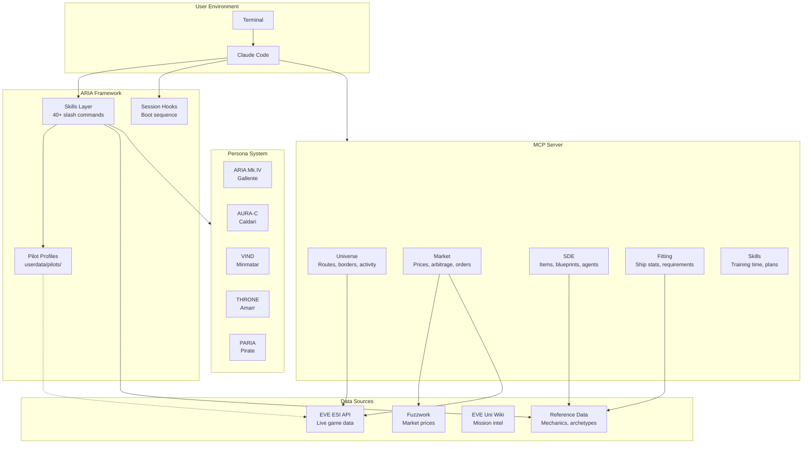

# Architecture Overview

How ARIA's components fit together.

## System Diagram



## Component Descriptions

### User Environment

| Component | Description |
|-----------|-------------|
| **Terminal** | Where you run `claude` command |
| **Claude Code** | Anthropic's AI CLI that hosts ARIA |

### ARIA Framework

| Component | Path | Description |
|-----------|------|-------------|
| **Skills** | `.claude/skills/` | 40+ slash commands for tactical intel, market analysis, operations |
| **Hooks** | `.claude/hooks/` | Session initialization, boot sequence display |
| **Profiles** | `userdata/pilots/` | Per-pilot configuration, standings, ship rosters |

### MCP Server

The Model Context Protocol server provides structured data access:

| Dispatcher | Actions | Description |
|------------|---------|-------------|
| `universe()` | route, borders, activity, hotspots | Navigation and system intel |
| `market()` | prices, orders, arbitrage, valuation | Market data and analysis |
| `sde()` | item_info, blueprints, agents | Static game data |
| `fitting()` | calculate_stats, requirements | Ship fitting calculations |
| `skills()` | training_time, easy_80_plan | Skill planning |

### Data Sources

| Source | Type | Description |
|--------|------|-------------|
| **EVE ESI** | Live API | Character data, market orders, system activity |
| **Fuzzwork** | Aggregated | Market prices across regions |
| **EVE Uni Wiki** | Reference | Mission walkthroughs, cached locally |
| **Reference Data** | Static | Game mechanics, damage profiles, archetypes |

### Persona System

Optional roleplay layer activated by `rp_level` setting:

| Persona | Faction | Voice |
|---------|---------|-------|
| ARIA Mk.IV | Gallente | Libertarian, cultured |
| AURA-C | Caldari | Corporate, efficient |
| VIND | Minmatar | Direct, tribal |
| THRONE | Amarr | Reverent, imperial |
| PARIA | Pirate | Outlaw code, sardonic |

## Data Flow

### Query Flow (e.g., "Is Uedama safe?")

```
1. User asks question in terminal
2. Claude Code interprets intent
3. ARIA skill activated (/threat-assessment)
4. MCP universe() called for activity data
5. ESI queried for kills/jumps
6. Response formatted (with persona voice if RP enabled)
7. Displayed to user
```

### ESI Sync Flow

```
1. User runs aria-esi sync (or automatic on session start)
2. ESI tokens validated/refreshed
3. Character data fetched (location, skills, wallet)
4. Profile updated with fresh data
5. Cached for session use
```

## Directory Structure

```
aria/
├── .claude/
│   ├── hooks/          # Session lifecycle
│   ├── scripts/        # Utility scripts
│   └── skills/         # Slash commands
│
├── src/aria_esi/
│   ├── commands/       # CLI commands
│   ├── mcp/            # MCP server implementation
│   └── services/       # Core services
│
├── userdata/           # User data (gitignored)
│   ├── pilots/         # Per-pilot profiles
│   └── credentials/    # ESI tokens
│
├── reference/          # Game reference data
│   ├── mechanics/      # Static game data
│   └── pve-intel/      # Mission cache
│
├── personas/           # Faction AI personas
│   ├── aria-mk4/       # Gallente
│   ├── aura-c/         # Caldari
│   ├── vind/           # Minmatar
│   ├── throne/         # Amarr
│   ├── paria/          # Pirate
│   └── _shared/        # Common resources
│
└── docs/               # Documentation
```
